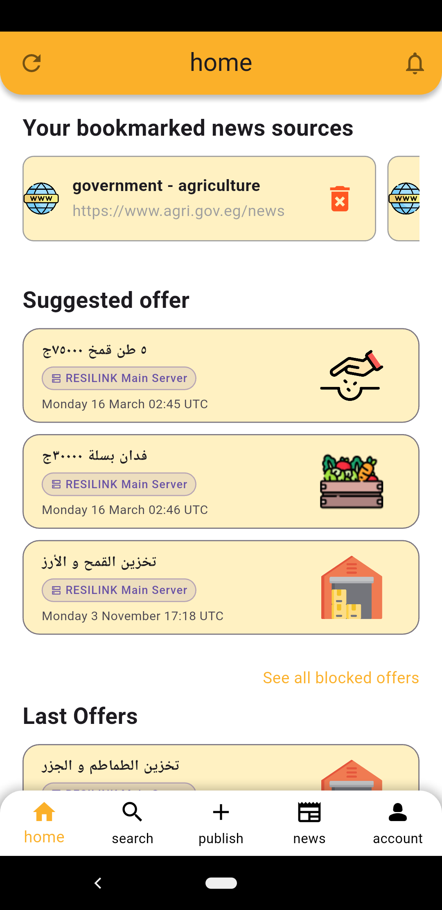
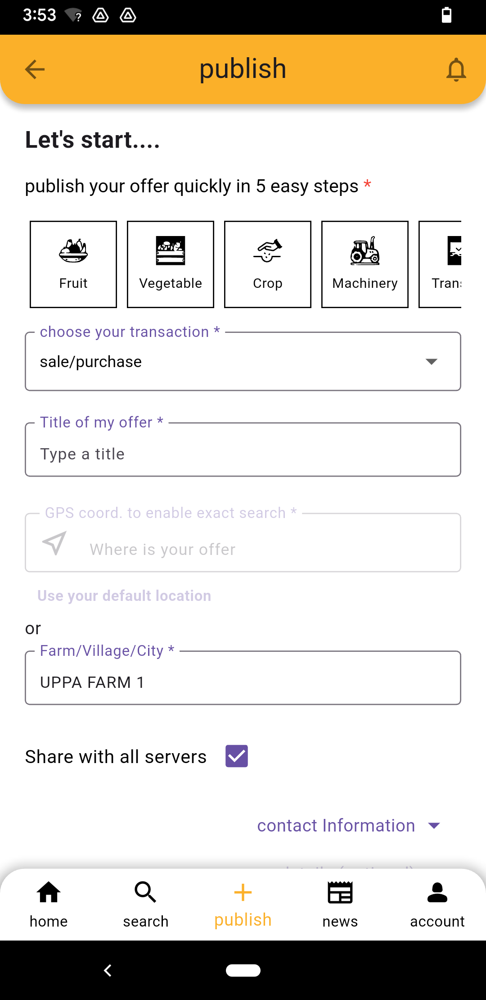

# Resilink Mobile Application

RESILINK (2022-2026) is a project funded by the PRIMA Programme supported by the European Union. The project web site is https://resilink.eu/

A Flutter mobile application built as a functional POC for the **RESILINK platform** — a service exchange network designed for the agricultural sector in the Maghreb region (Morocco, Algeria, Egypt).

The app enables farmers, producers, breeders, and rural workers to **offer, request, or share services, equipment, and skills** quickly and accessibly, even for users with limited literacy or limited familiarity with mobile apps.

You can find all screenshots of the latest version of the RESILINK Mobile App here: https://resilink.eu/screenshots-of-the-resilink-mobile-app

<p align="center">
  
  &nbsp;&nbsp;
  
</p>

---

## About the Project

- **Platform:** Android (primary target), Linux
- **Version:** 1.0.0+31
- **Language:** Flutter / Dart
- **API:** RESILINK REST API
- **Localization:** English (`en`) and Arabic (`ar`)

---

## Features

| Feature | Description |
|---|---|
| Authentication | Sign in / Sign up with username and password |
| Offer Management | Publish, browse, search, modify, delete, and purchase offers |
| Contract Tracking | Track purchase contract states (Pending → Proceeding → Delivered → Received) |
| News | Browse and bookmark agricultural news sources |
| Account | Manage profile, location, activity domain, and settings |
| Localization | Full English and Arabic support (incl. RTL layout) |
| Onboarding | Guided introduction for new users |
| About Us | RESILINK platform description and useful links |
| GPS & Location | Default location storage and GPS coordinate input |
| Image Upload | Pick images from gallery, camera, or default asset library |
| Server selection | Switch between available RESILINK API servers |

---

## Project Structure

```
lib/
├── main.dart                  # App entry point
├── main_service.dart          # Core service initialization
├── firebase_options.dart      # Firebase configuration
├── common/                    # Shared widgets and utilities
├── constants/                 # App-wide constants (colors, styles, etc.)
├── models/                    # Data models
├── providers/                 # State management (Provider)
├── l10n/                      # Localization files (ARB + generated Dart)
│   ├── app_en.arb
│   └── app_ar.arb
└── features/
    ├── account/               # Profile, settings, language, password
    ├── home/                  # Home feed with offers and news
    ├── home_navigation/       # Bottom navigation scaffold
    ├── news_page/             # News sources browsing
    ├── onboarding/            # First-launch walkthrough
    ├── publish/               # Offer creation and editing
    ├── registration/          # Login and sign-up
    ├── search/                # Keyword and GPS-based offer search + offer details page
    ├── select_country/        # Country selection on first launch
    └── splash_screen/         # Splash screen
```

---

## Key Dependencies

| Package | Purpose |
|---|---|
| `provider` | State management |
| `shared_preferences` | Persistent local storage |
| `http` | REST API communication |
| `flutter_localizations` + `intl` | Multilingual support |
| `image_picker` | Camera / gallery image selection |
| `location` + `permission_handler` | GPS and permissions |
| `flutter_svg` | SVG asset rendering |
| `url_launcher` | Open external links |
| `firebase_core` + `firebase_analytics` | Analytics |
| `flutter_rating_bar` | App rating UI |

---

## Getting Started

### Prerequisites

- Flutter SDK `^3.8.1`
- Android SDK (for Android builds)
- A running instance of the RESILINK API server

### Firebase setup (required)

This repository does **not** include Firebase configuration files as they contain sensitive API keys. Before running the app, you must provide the following files:

| File | How to obtain |
|---|---|
| `lib/firebase_options.dart` | Run `flutterfire configure` with your Firebase project, or copy it from your Firebase console |
| `android/app/google-services.json` | Download from your Firebase project settings under **Android app** |

Without these two files the app will not compile.

### Android release signing (required for release builds)

The repository excludes both the keystore file and the `key.properties` file (both are listed in `android/.gitignore`). You must provide them manually before building a release APK.

**1. Generate the keystore**

Run this command from the root of the project:

```bash
keytool -genkey -v \
  -keystore android/RESILINK.jks \
  -alias upload \
  -keyalg RSA \
  -keysize 2048 \
  -validity 10000
```

You will be prompted for a store password, a key password, and identity information (name, organization, etc.). Keep these values safe — you will need them in the next step.

**2. Create `android/key.properties`**

Create the file `android/key.properties` with the following content, replacing the passwords with the ones you chose:

```
storePassword=<your_store_password>
keyPassword=<your_key_password>
keyAlias=upload
storeFile=./RESILINK.jks
```

> `storeFile` is relative to the `android/` directory, so `./RESILINK.jks` points to `android/RESILINK.jks`.

**3. Never commit these files**

`android/.gitignore` already excludes both files:

```
key.properties
**/*.jks
```

Do **not** override or remove these entries.

---

### Install dependencies

```bash
flutter pub get
```

### Run the app

```bash
flutter run
```

### Generate localizations

```bash
flutter gen-l10n
```

### Build Android APK

```bash
flutter build apk --release
```

---

## Branches

| Branch | Description |
|---|---|
| `main` | Stable / production-ready code |
| `dev` | Active development branch |

---

## Notes

- This is a **POC** (Proof of Concept) and is not intended for public distribution (`publish_to: none`).
- The app targets the Maghreb agricultural community and is designed to be usable by people with limited digital literacy.
- Arabic support includes full RTL layout adaptation.
